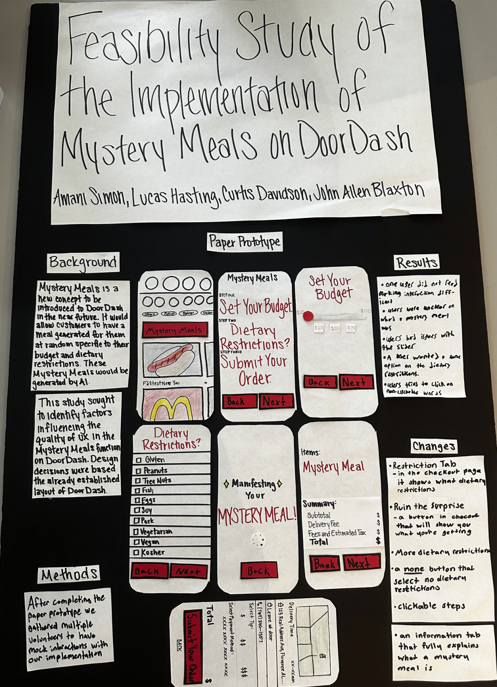

# Human Computer Interaction/User Experience
This repository holds my groups final project for the class. The project was a feasibility study of a "I'm feeling lucky" functionality for door dash named "Mystery Meals". It can be downloaded [here](https://github.com/LucasHasting/HCI-UX-Final-Project/blob/main/HCI_UX.pdf).

## The Prototype

